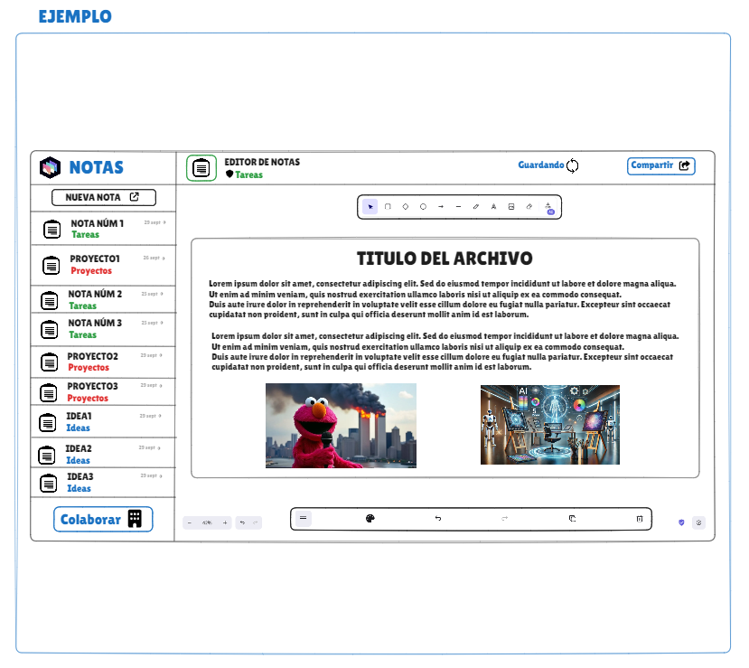
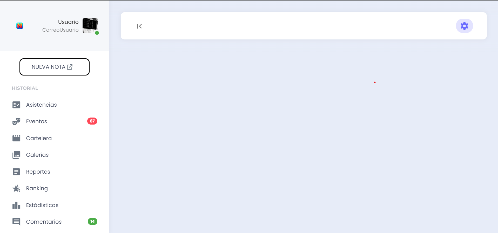
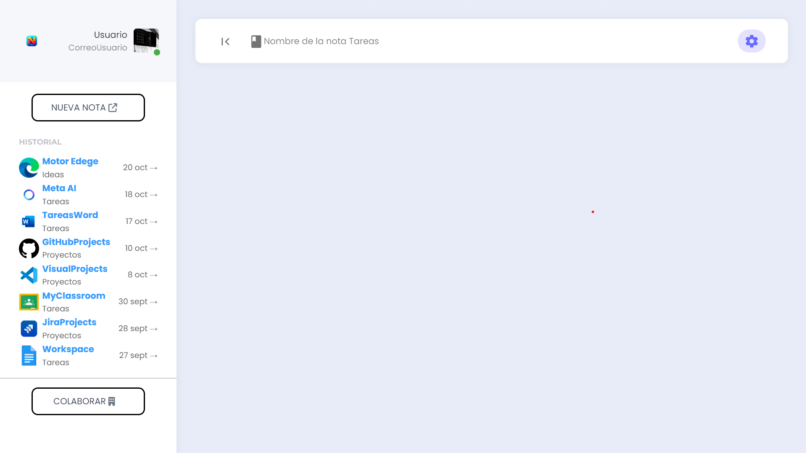
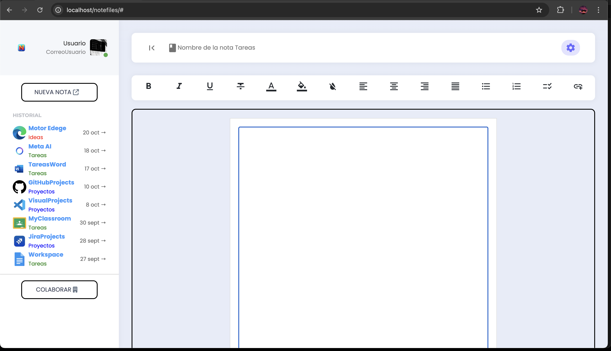
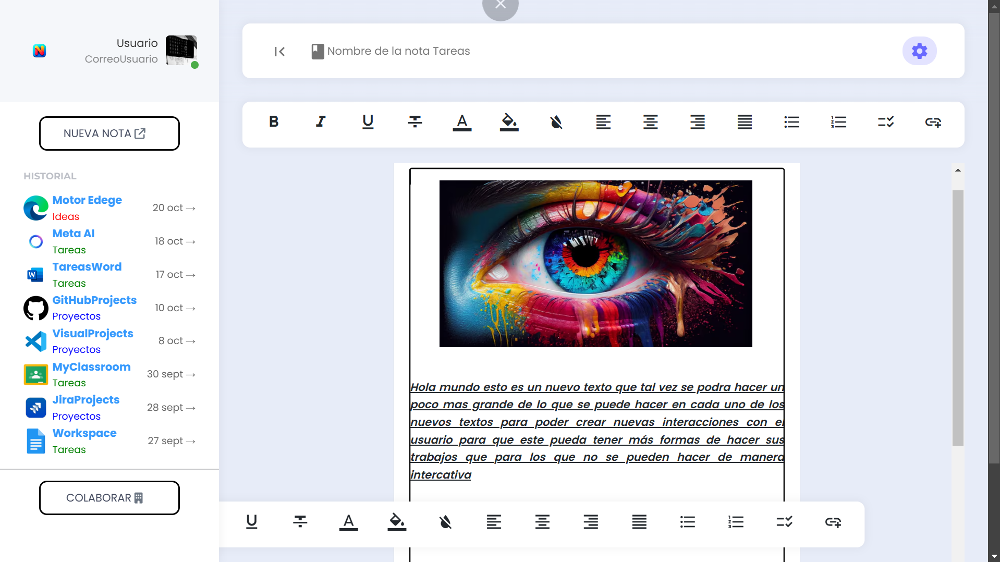
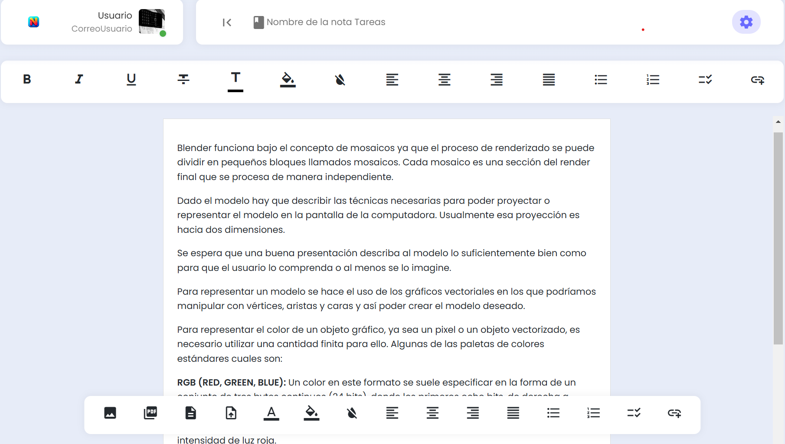
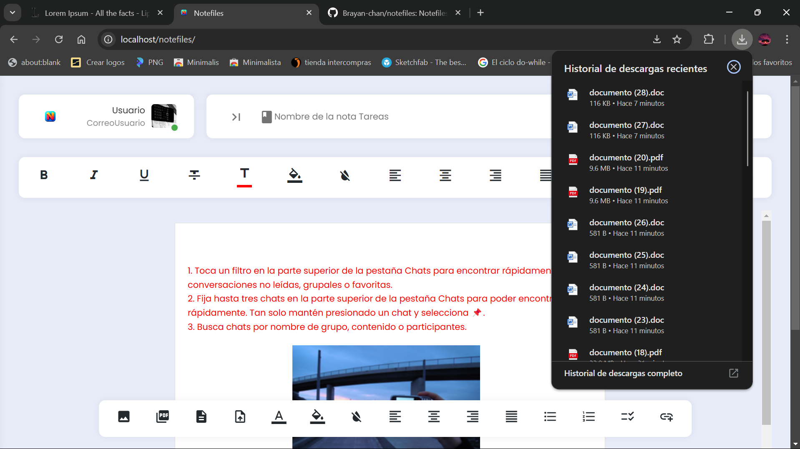
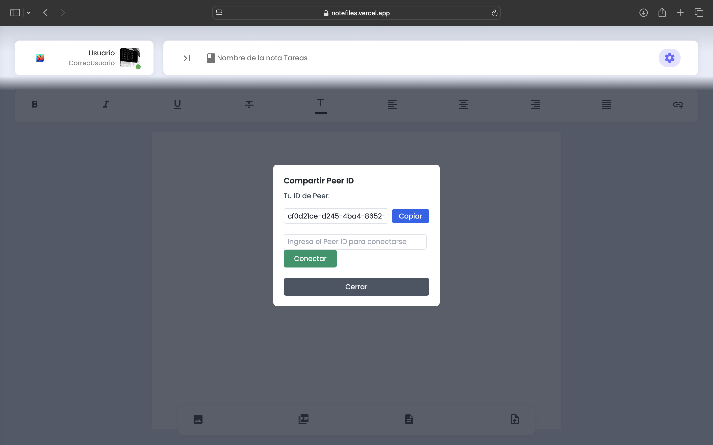

# Inicio basico del proyecto notefiles

## 🚀 Estructura del proyecto

Dentro del proyecto, verás las siguientes carpetas y archivos:

```text
/
├── Assets/
│   ├── css/
│   │   ├── horizontal-menu/
│   ├── images/
│   │   ├── avatars/
│   │   ├── backgrounds/
│   │   ├── cards/
│   │   ├── flags/
│   │   ├── icons/
│   │   ├── other/
│   │   ├── widgets/
│   ├── js/
│   │   └── addImage.js
│   │   └── addLink.js
│   │   └── aligns.js
│   │   └── drag-custom.js
│   │   └── format.js
│   │   └── pagination.js
│   │   └── pages/
│   ├── plugins/
│   │   ├── bootstrap/
│   │   ├── perfectscroll/
├── avances/
│   └── avance1.png
│   └── avance2.png
│   └── avance3.png
│   └── avance4.png
│   └── avance5.png
│   └── avance6.png
│   └── avance7.png
│   └── idea.png
└── README.md
└── index.html
```
## 😎 Avances

<div align="center">
  
 > Idea de Ejemplo

  

> Avance 20/10/2024

  

> Avance2 20/10/2024

  

> Avance3 21/10/2024

  

> Avance4 26/10/2024

  

> Avance5 27/10/2024

  

> Avance6 29/10/2024

  

> Avance7 10/11/2024

  
</div>
